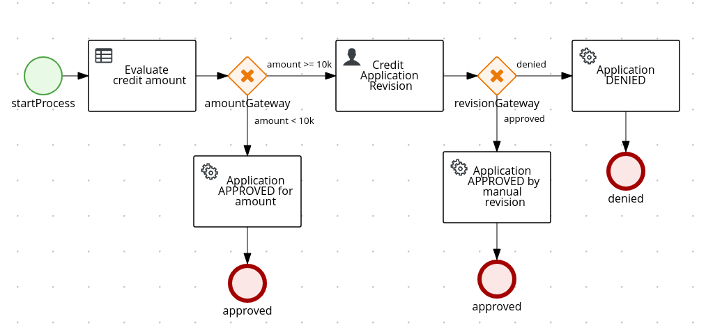

# POC - Simple Credit Application Process.

POC of a credit application process that includes a Desicion Rule, a User Task and Service Tasks.

<p align="center"></p>

This BPMN file (creditApplicationProcess.bpmn) is in src/main/resources/com/bbva/kgtmx/ directory.
Open the creditApplicationProcess.bpmn file in [Asset Editor for Kogito and Process Automation](https://kiegroup.github.io/kogito-online/) to see in detail the modeling and configuration of this Process Automation.

This Credit Application Process needs...

* accountReference: The reference of the account where the credit will be deposited,
* amount: Credit application amount,
* clientName: Client name.

#### - Desicion Rule

This desicion rule evaluates the incomming credit amount.

If the credit amount is less than $10,000, the credit is automatically Approved.
Otherwise, the credit application must be approved or denied manually by a user in a User Task.

This DRL file (creditAmount-rules.drl) is in src/main/resources/com/bbva/kgtmx/ directory.

```java
package com.bbva.kgtmx;

import com.bbva.kgtmx.model.CreditApplication;


rule "Credit Application Approved" ruleflow-group "creditApplication"

when
    $creditApplication: CreditApplication(amount < 10000)
then
    modify($creditApplication) {
    	isApproved(true)
    };

end

rule "Credit Application Denied" ruleflow-group "creditApplication"

when
    $creditApplication: CreditApplication(amount >= 10000)
then
    modify($creditApplication) {
    	isApproved(false)
    };

end
```

#### - User Task

If the credit amount if more or equal to $10,000, the credit application must be approved or denied manually by a user in a User Task by a POST service where the process identifier, the task identifier, the resolution of the credit application and the rest of the credit application data must be informed.

#### - Service Tasks

Before finalizing each instance of process regardless of the resolution of the credit application, the process calls an independent Service Task, which in this case, only writes a log with the resolution of the credit application with its respective reason, in addition of the credit application data.

## Requisites

You will need:
  - Java 11+ installed
  - Environment variable JAVA_HOME set accordingly
  - Maven 3.6.2+ installed
  - Docker

When using native image compilation, you will also need:
  - [GraalVM 19.3.1](https://github.com/oracle/graal/releases/tag/vm-19.3.1) installed
  - Environment variable GRAALVM_HOME set accordingly
  - Note that GraalVM native image compilation typically requires other packages (glibc-devel, zlib-devel and gcc) to be installed too.  You also need 'native-image' installed in GraalVM (using 'gu install native-image'). Please refer to [GraalVM installation documentation](https://www.graalvm.org/docs/reference-manual/aot-compilation/#prerequisites) for more details.


## Running

#### - Compile and Run

```bash
mvn clean package quarkus:dev
```

#### - Package and Run in JVM mode

```bash
mvn clean package
java -jar target/jbpm-kogito-creditApplicationProcess-1.0.0-runner.jar
```

#### - Package and Run using Local Native Image

Note that this requires GRAALVM_HOME to point to a valid GraalVM installation

```bash
mvn clean package -Pnative
```

To run the generated native executable, generated in `target/`, execute

```bash
./target/jbpm-kogito-creditApplicationProcess-1.0.0-runner
```

## Containerize the application using Docker

#### - Generate the Docker image

```bash
docker build -f Dockerfile -t jbpm-credit-application-process .
```
#### - Generate the container 

```bash
docker run -p 8080:8080 -m 16m --cpus=.25 -d --name jbpm-credit-application-process jbpm-credit-application-process
```
## Testing

### Swagger documentation

You can visualize and interact with the generated specification using the embbeded [Swagger UI](http://localhost:8080/swagger-ui).

Once the service is up and running, you can use the following example to interact with the service.

* ### Example Usage - Credit Application APPROVED by amount less than $10,000

###### POST /creditApplications

Curl command:

```bash
curl -X POST "http://localhost:8080/creditApplications" -H "accept: application/json" -H "Content-Type: application/json" -d "{\"creditApplication\":{\"accountReference\":\"AM12345\",\"amount\":5000,\"clientName\":\"Maria Torres\"}}"
```
As response, Credit Application Resolution is returned

###### Example response:

```json
{
  "id": "57bdb36f-a9a1-4d20-9c88-d59ea3748a80",
  "creditApplication": {
    "accountReference": "AM12345",
    "clientName": "Maria Torres",
    "amount": 5000,
    "approved": true
  }
}
```

And check the information painted in the log.

###### Example log:

```log
2020-04-29 18:09:00,624 INFO  [com.bbv.kgt.ser.CreditApplicationService] (executor-thread-1) ::: CREDIT APPLICATION APPROVED FOR AMOUNT LESS THAN $10,000 :::
2020-04-29 18:09:00,624 INFO  [com.bbv.kgt.ser.CreditApplicationService] (executor-thread-1) :::::: CreditApplicationData [accountReference=AM12345, amount=5000.0, approved=true, clientName=Maria Torres]
```


* ### Example Usage - Credit Application APPROVED by User Task

###### POST /creditApplications

Curl command:

```bash
curl -X POST "http://localhost:8080/creditApplications" -H "accept: application/json" -H "Content-Type: application/json" -d "{\"creditApplication\":{\"accountReference\":\"AT789456\",\"amount\":10000,\"clientName\":\"Gabriel Gonzalez\"}}"
```
As response, Credit Application Resolution is returned

###### Example response:

```json
{
  "id": "582f56c3-d5ad-436a-8618-1f7a70811c2b",
  "creditApplication": {
    "accountReference": "AT789456",
    "clientName": "Gabriel Gonzalez",
    "amount": 10000,
    "approved": false
  }
}
```

The credit application has not yet been resolved since it needs to be completed from the User Task.
Now, we get the identifier of the user task of the process that we have generated:

###### GET /creditApplications/{id}/tasks

Curl command:

```bash
curl -X GET "http://localhost:8080/creditApplications/582f56c3-d5ad-436a-8618-1f7a70811c2b/tasks" -H "accept: application/json"
```

As response, the workItemId of the process is returned

###### Example response:

```json
{
  "a4e052a2-d403-4a30-915c-bc593bc28dbb": "creditApplicationRevision"
}
```

Complete the User Task indicating the APPROVAL of the credit application with its respective information.

###### POST /creditApplications/{id}/creditApplicationRevision/{workItemId}

```bash
curl -X POST "http://localhost:8080/creditApplications/582f56c3-d5ad-436a-8618-1f7a70811c2b/creditApplicationRevision/a4e052a2-d403-4a30-915c-bc593bc28dbb?phase=complete" -H "accept: application/json" -H "Content-Type: application/json" -d "{\"creditApplication\":{\"accountReference\":\"AT789456\",\"amount\":10000,\"approved\":true,\"clientName\":\"Gabriel Gonzalez\"}}"
```

As response, Credit Application Resolution is returned

###### Example response:

```json
{
  "id": "582f56c3-d5ad-436a-8618-1f7a70811c2b",
  "creditApplication": {
    "accountReference": "AT789456",
    "clientName": "Gabriel Gonzalez",
    "amount": 10000,
    "approved": true
  }
}
```

And check the information painted in the log.

###### Example log:

```log
2020-04-29 18:39:42,511 INFO  [com.bbv.kgt.ser.CreditApplicationService] (executor-thread-1) ::: CREDIT APPLICATION APPROVED IN MANUAL REVISION :::
2020-04-29 18:39:42,511 INFO  [com.bbv.kgt.ser.CreditApplicationService] (executor-thread-1) :::::: CreditApplicationData [accountReference=AT789456, amount=10000.0, approved=true, clientName=Gabriel Gonzalez]
```


* ### Example Usage - Credit Application DENIED by User Task

###### POST /creditApplications

Curl command:

```bash
curl -X POST "http://localhost:8080/creditApplications" -H "accept: application/json" -H "Content-Type: application/json" -d "{\"creditApplication\":{\"accountReference\":\"DT089456\",\"amount\":100000,\"clientName\":\"Pedro Lopez\"}}" 
```
As response, Credit Application Resolution is returned

###### Example response:

```json
{
  "id":"b73f6ac5-3e37-4b69-be31-f28dc543b673",
  "creditApplication": {
    "accountReference":"DT089456",
    "clientName":"Pedro Lopez",
    "amount":100000.0,
    "approved":false
  }
}
```

The credit application has not yet been resolved since it needs to be completed from the User Task.
Now, we get the identifier of the user task of the process that we have generated:

###### GET /creditApplications/{id}/tasks

Curl command:

```bash
curl -X GET "http://localhost:8080/creditApplications/b73f6ac5-3e37-4b69-be31-f28dc543b673/tasks" -H "accept: application/json"
```

As response, the workItemId of the process is returned

###### Example response:

```json
{
  "cb0bb759-e4d8-4f9e-8e29-ea6c7f9c5a85":"creditApplicationRevision"
}
```

Complete the User Task indicating the DENIAL of the credit application with its respective information.

###### POST /creditApplications/{id}/creditApplicationRevision/{workItemId}

```bash
curl -X POST "http://localhost:8080/creditApplications/b73f6ac5-3e37-4b69-be31-f28dc543b673/creditApplicationRevision/cb0bb759-e4d8-4f9e-8e29-ea6c7f9c5a85?phase=complete" -H "accept: application/json" -H "Content-Type: application/json" -d "{\"creditApplication\":{\"accountReference\":\"DT089456\",\"amount\":100000,\"approved\":false,\"clientName\":\"Pedro Lopez\"}}"
```

As response, Credit Application Resolution is returned

###### Example response:

```json
{
  "id":"b73f6ac5-3e37-4b69-be31-f28dc543b673",
  "creditApplication": {
    "accountReference":"DT089456",
    "clientName":"Pedro Lopez",
    "amount":100000.0,
    "approved":false
  }
}
```

And check the information painted in the log.

###### Example log:

```log
2020-04-29 18:56:16,320 INFO  [com.bbv.kgt.ser.CreditApplicationService] (executor-thread-1) ::: CREDIT APPLICATION DENIED IN MANUAL REVISION :::
2020-04-29 18:56:16,320 INFO  [com.bbv.kgt.ser.CreditApplicationService] (executor-thread-1) :::::: CreditApplicationData [accountReference=DT089456, amount=100000.0, approved=false, clientName=Pedro Lopez]
```